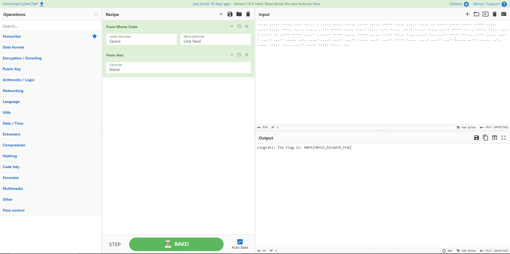
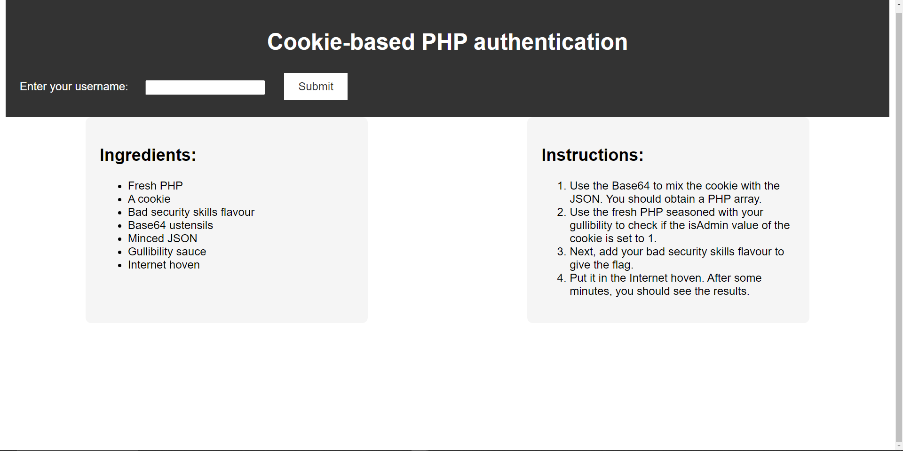

# N0PSctf
- [N0PSctf](#n0psctf)
- [Solved Task writeup](#solved-task-writeup)
  - [Jojo is missing! `The Rescue of Jojo`](#jojo-is-missing-the-rescue-of-jojo)
  - [Morse Me `Misc`](#morse-me-misc)
  - [Web cook `Web`](#web-cook-web)
  - [Just read `Reverse`](#just-read-reverse)
  - [Where am I 1/3 `OSINT`](#where-am-i-13-osint)
---
This is my repository for N0PSctf via [<ins>competition link<ins>](https://ctf.nops.re/) , [<ins>ctf time link<ins>](https://ctftime.org/event/2358) <br>
Held from 1-3 June GMT+7.


I was able to solve 5 task in the [Solved Folder](SOLVED/) <br>
And other problems that i try to solve but failed is in the [Unsolved Folder](UNSOLVED/)

And Each Task's Flag is in the flag.txt

Other task that i solved after the competition ended will be in the [Try Folder](TRY/)


---

# Solved Task writeup
## Jojo is missing! `The Rescue of Jojo`

```
We have received a message from Jojo, join out Discord server to read it: https://discord.com/invite/xqvnaGzG6x
```

This task prompted you to join discord server via the link<br>
after that you will see this message

<br>

you will get this hex code<br>
```
49 66 20 61 6E 79 6F 6E 65 20 72 65 61 64 73 20 69 74 2C 20 49 20 61 6D 20 4A 6F 6A 6F 2E 20 49 20 68 61 76 65 20 62 65 65 6E 20 63 61 70 74 75 72 65 64 20 62 79 20 61 20 67 72 6F 75 70 20 63 61 6C 6C 65 64 20 4A 33 4A 75 4A 34 2E 20 50 6C 65 61 73 65 20 63 6F 6D 65 20 61 6E 64 20 73 61 76 65 20 6D 65 21 0A 4E 30 50 53 7B 4A 30 4A 30 5F 31 73 5F 6D 31 53 35 31 6E 47 21 7D
```
Then I decode it with <br>
```
xxd -r -p
```
We get 
```
If anyone reads it, I am Jojo. I have been captured by a group called J3JuJ4. Please come and save me!
N0PS{J0J0_1s_m1S51nG!}
```
so i use grep to grep the flag and save it in flag.txt
```
cat discord-message.txt | xxd -r -p | grep "N0PS{.*}" > flag.txt
```
We got the flag:
``` 
N0PS{J0J0_1s_m1S51nG!}
```
## Morse Me `Misc`

<br>

Download the [challenge.txt](/SOLVED/morse-me/challenge.txt) file<br>
```
....- ...-- -.... ..-. -.... . -.... --... --... ..--- -.... .---- --... ....- --... .- ..--- .---- ..--- ----- ..... ....- -.... ---.. -.... ..... ..--- ----- -.... -.... -.... -.-. -.... .---- -.... --... ..--- ----- -.... ----. --... ...-- ...-- .- ..--- ----- ....- . ...-- ----- ..... ----- ..... ...-- --... -... ....- -.. ...-- ----- --... ..--- ..... ...-- ...-- ...-- ..... ..-. ....- ....- ...-- ...-- -.... ...-- ...-- ----- -.... ....- ...-- ...-- ..... ..--- ..... ..-. ..... ----- --... ..--- ...-- ----- --... -..
```
Decode this via [CyberChef](https://gchq.github.io/CyberChef/)<br>

<br>

or we can do this
```
cat morse-to-hex.txt | xxd -r -p | grep -o N0PS{.*} > flag.txt && cat flag.txt
```
We get the flag
```
N0PS{M0rS3_D3c0d3R_Pr0}
```
## Web cook `Web`
<br>

Enter the web

<br>

Enter any username , in my case i use "admin"

<br>

I guess this task is about cookie so i use F12 to check cookie

<br>

The [cookie](SOLVED\web-cook\cook.txt) value seems to be base64 so i decode it and got
```
{"username":"admin","isAdmin":0}
```
The instructions suggest that i should do something wiht this PHP array
So i change the "isAdmin" value to 1 
```
{"username":"admin","isAdmin":1}
```
Then encode it back to base64
```
eyJ1c2VybmFtZSI6ImFkbWluIiwiaXNBZG1pbiI6MX0K
```
Enter this to be the value of session cookie and refresh the page 

<br>

We got the flag
```
N0PS{y0u_Kn0W_H0w_t0_c00K_n0W}
```
## Just read `Reverse`

<br>

I check the main file and it's linux executable

<br>

I use ghidra to check the main function of this file

<br>

And i found this 

```c
if (sVar24 == 0x17 &&
    ((((((((((((((((((((((cVar2 == '0' && cVar1 == 'N') && cVar3 == 'P') && cVar4 == 'S') &&
                      cVar5 == '{') && cVar6 == 'c') && cVar7 == 'H') && cVar8 == '4') &&
                  cVar9 == 'r') && cVar10 == '_') && cVar11 == '1') && cVar12 == 's') &&
              cVar13 == '_') && cVar14 == '8') && cVar15 == 'b') && cVar16 == 'i') &&
          cVar17 == 't') && cVar18 == 's') && cVar19 == '_') && cVar20 == '1') && cVar21 == 'N')
      && cVar22 == 't') && cVar23 == '}')) {
  puts("Well done, you can validate with this flag!");
}
```
I then solve this with a oneliner
```
grep -o "cVar[0-9]* == '[^']'" | awk -F "'" '{print $2}' | tr -d "\n" | sed 's/0NPS/N0PS/'
```
We get the flag
```
N0PS{cH4r_1s_8bits_1Nt}
```


## Where am I 1/3 `OSINT`
